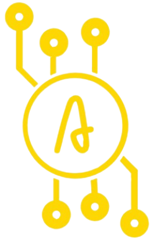

[![Contributors][contributors-shield]][contributors-url]
[![Issues][issues-shield]][issues-url]
[![MIT License][license-shield]][license-url]
[![LinkedIn][linkedin-shield]][linkedin-url]

<!-- PROJECT LOGO -->
<br />
<p align="center">
  <a href="https://github.com/larsniet/algorithm-coin">
    
  </a>

  <h3 align="center">Algorithm Coin</h3>

  <p align="center">
    The future of automatic trading
    <br />
    <br />
    <a href="https://algorithmcoin.com">View Website</a>
    ·
    <a href="https://github.com/larsniet/algorithm-coin/issues">Report Bug</a>
    ·
    <a href="https://github.com/larsniet/algorithm-coin/issues">Request Feature</a>
  </p>
</p>

<!-- TABLE OF CONTENTS -->
<details open="open">
  <summary>Table of Contents</summary>
  <ol>
    <li>
      <a href="#about-the-project">About Algorithm Coin</a>
      <ul>
        <li><a href="#built-with">Built With</a></li>
      </ul>
    </li>
    <li>
      <a href="#getting-started">Getting Started</a>
      <ul>
        <li><a href="#prerequisites">Prerequisites</a></li>
        <li><a href="#installation">Installation</a></li>
      </ul>
    </li>
    <li><a href="#usage">Usage</a></li>
    <li><a href="#roadmap">Roadmap</a></li>
    <li><a href="#contributing">Contributing</a></li>
    <li><a href="#license">License</a></li>
    <li><a href="#contact">Contact</a></li>
  </ol>
</details>

<!-- ABOUT THE PROJECT -->

## About Algorithm Coin

[![Product Name Screen Shot][product-screenshot]](https://larsvanderniet.nl)

Our team at Algorithm Coin is working on an application to trade automatically like a day trader. Advanced software that uses AI and pattern recognition technology makes it possible to make big profits in the crypto market. A demo is currently being worked on. In the future this application will be available for Algorithm Coin holders.

In order to present the software we provide, we created this application.
Here's why:

### Built With


<!-- GETTING STARTED -->

## Getting Started

Below are the steps required to run this application locally.

### Prerequisites

Most people cloning this repository will have NPM installed, but just in case :).

- npm
  ```sh
  npm install npm@latest -g
  ```

### Installation

```shell
# Clone this repository
$ git clone https://github.com/larsniet/algorithm-coin.git

# Go into the directory
$ cd algorithm-coin

# Install dependencies
$ npm install
```

<!-- ROADMAP -->

## Roadmap

See the [open issues](https://github.com/larsniet/algorithm-coin/issues) for a list of proposed features (and known issues).

<!-- CONTRIBUTING -->

## Contributing

Contributions are what make the open source community such an amazing place to learn, inspire, and create. Any contributions you make are **greatly appreciated**.

1. Fork the Project
2. Create your Feature Branch (`git checkout -b feature/AmazingFeature`)
3. Commit your Changes (`git commit -m 'Add some AmazingFeature'`)
4. Push to the Branch (`git push origin feature/AmazingFeature`)
5. Open a Pull Request

<!-- LICENSE -->

## License

Distributed under the MIT License. See `LICENSE` for more information.

<!-- CONTACT -->

## Contact

Ruben Visser - [@rubenvisser22](https://twitter.com/rubenvisser22) - rubenvisser22@gmail.com

Project Link: [https://github.com/larsniet/algorithm-coin](https://github.com/larsniet/algorithm-coin)
