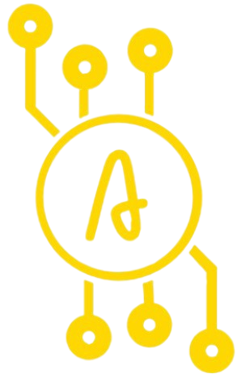

<p align="center">
    <a href="" alt="Build"> 
        </a
    <a href="https://github.com/badges/shields/graphs/contributors" alt="Contributors">
        </a>
    <a href="https://github.com/Algorithm-Coin/react-webapp/issues" alt="Issues">
        </a>
    <a href="https://github.com/Algorithm-Coin/react-webapp/blob/main/LICENSE" alt="License">
        </a>
    <a href="https://app.netlify.com/sites/algorithmcoin/deploys" alt="Contributors">
        </a>
</p>

<!-- PROJECT LOGO -->
<br />
<p align="center">
  <a href="https://github.com/Algorithm-Coin/react-webapp">
    
  </a>

  <h3 align="center">Algorithm Coin</h3>

  <p align="center">
    The future of automatic trading
    <br />
    <br />
    <a href="https://algorithmcoin.netlify.app/">View Website</a>
    ·
    <a href="https://github.com/Algorithm-Coin/react-webapp/issues">Report Bug</a>
    ·
    <a href="https://github.com/Algorithm-Coin/react-webapp/issues">Request Feature</a>
  </p>
</p>

<!-- TABLE OF CONTENTS -->
<details open="open">
  <summary>Table of Contents</summary>
  <ol>
    <li>
      <a href="#about-algorithm-coin">About Algorithm Coin</a>
      <ul>
        <li><a href="#built-with">Built With</a></li>
      </ul>
    </li>
    <li>
      <a href="#getting-started">Getting Started</a>
      <ul>
        <li><a href="#prerequisites">Prerequisites</a></li>
        <li><a href="#installation">Installation</a></li>
      </ul>
    </li>
    <li><a href="#usage">Usage</a></li>
    <li><a href="#roadmap">Roadmap</a></li>
    <li><a href="#contributing">Contributing</a></li>
    <li><a href="#license">License</a></li>
    <li><a href="#contact">Contact</a></li>
  </ol>
</details>

<!-- ABOUT THE PROJECT -->

## About Algorithm Coin


Our team at Algorithm Coin is working on an application to trade automatically like a day trader. Advanced software that uses AI and pattern recognition technology makes it possible to make big profits in the crypto market. A demo is currently being worked on. In the future this application will be available for Algorithm Coin holders.

In order to present the software we provide, we created this application.

### Built With


<!-- GETTING STARTED -->

## Getting Started

Below are the steps required to run this application locally.

### Prerequisites

Most people cloning this repository will have NPM installed, but just in case :).

- npm
  ```sh
  npm install npm@latest -g
  ```

### Installation

```shell
# Clone this repository
$ git clone git@github.com:Algorithm-Coin/react-webapp.git

# Go into the directory
$ cd react-webapp

# Install dependencies
$ npm install

# Start the app
$ npm run start
```

<!-- ROADMAP -->

## Roadmap

See the [open issues](https://github.com/Algorithm-Coin/react-webapp/issues) for a list of proposed features (and known issues).

<!-- CONTRIBUTING -->

## Contributing

Contributions are what make the open source community such an amazing place to learn, inspire, and create. Any contributions you make are **greatly appreciated**.

1. Fork the Project
2. Create your Feature Branch (`git checkout -b feature/AmazingFeature`)
3. Commit your Changes (`git commit -m 'Add some AmazingFeature'`)
4. Push to the Branch (`git push origin feature/AmazingFeature`)
5. Open a Pull Request

<!-- LICENSE -->

## License

Distributed under the MIT License. See `LICENSE` for more information.

<!-- CONTACT -->

## Contact

Project Link: [https://github.com/Algorithm-Coin/react-webapp](https://github.com/Algorithm-Coin/react-webapp)
